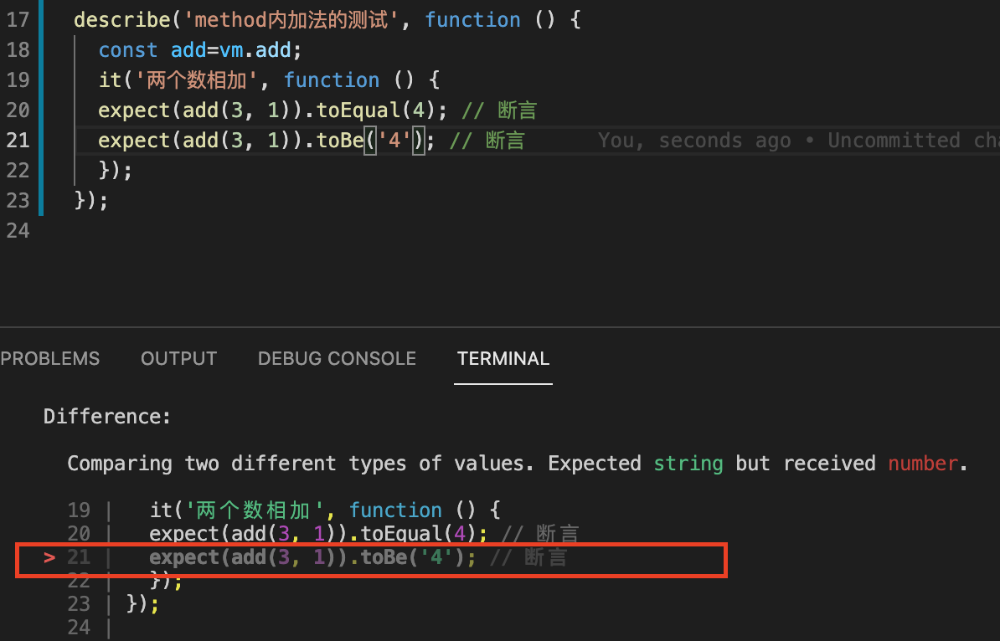

# vue-drugstore

- 分支 master:一个使用vue搭建的商城app（目前仅含商品列表页和商品详情页）
- 分支 cli3:以vue-cli，simple模式 的方式起了一个单页图表页面，不含element-ui,详见对方分支的readMe

## axios二次封装（仅限于master分支）
- 把请求内容集中到指定文件夹，避免视图页面满屏axios，具体可看```src/ChartPage.vue```
- 详细文档和分析见[这里](./doc/axios_analysis.md)

## 单元测试(仅限于master分支)
- 使用了jest，路由见```/hi```,测试代码见```/test/HelloWorld.spec.js```，对应组件页面```/components/HelloWorld.vue```
- 运行方式 ```npm run test```
- 理论参考文献：[知乎专栏](https://zhuanlan.zhihu.com/p/55960017)
- [jest常见异常处理](https://www.cnblogs.com/qpnets/p/10368998.html)
- 使用效果如图
## 项目需要
> nodejs 6.0+
> element ui

## Build Setup

``` bash
# install dependencies
npm install

# serve with hot reload at localhost:8088
npm run dev

# build for production with minification
npm run build

# build for production and view the bundle analyzer report
npm run build --report

# run unit tests
npm run unit

# run all tests
npm test
```

For a detailed explanation on how things work, check out the [guide](http://vuejs-templates.github.io/webpack/) and [docs for vue-loader](http://vuejs.github.io/vue-loader).


# other
#### configs
- master分支的配置在/config/index.js;cli3 分支的在vue.config.js
