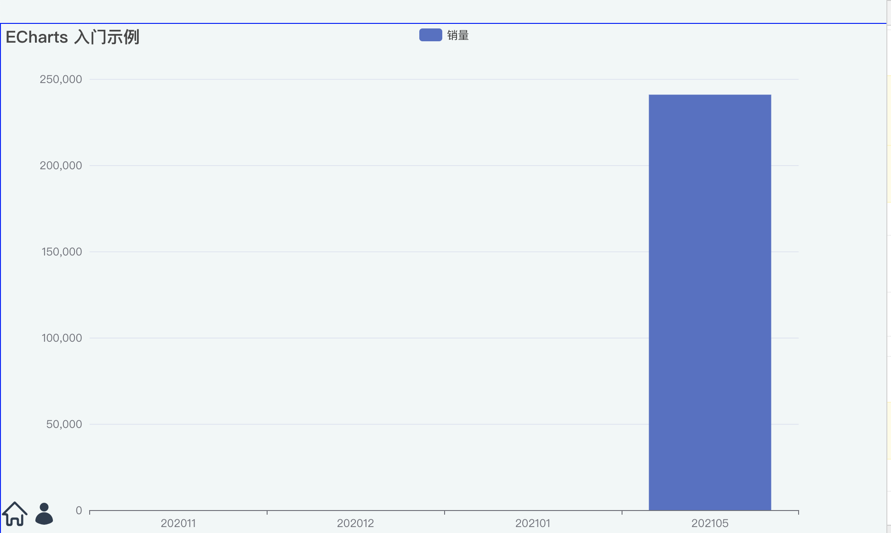

## axios二次封装
- 效果见图
- 

### 文件夹分析
具体代码解释在对应js页面里面有
#### /src/request/目录: 放自己包装过的请求方法和配置项
- ```server.js```:拦截器，请求头等
- ```getRequest.js```:通过原型的方式，自定义一些数据的默认处理方式

#### /src/api/目录:按业务划分接口内容
- 一个业务模块起一个js,然后在index里注册这些js
- ```index```:除了 import模块页面，还需要把getRequest的方法连接起来

#### /components/ChartPage.vue: 引用绑好的方法

```
// 新版写法(请求自动绑定)
    qa.v(this)
    qa.chart.getChart({
    method: 'get',
    bindName:'option1',
    data: {
        companyCode
    },
    success:(response)=>{     
        // 此处自定义方法                
        const barData = response.data.data.companyRiskAmountByMonthRespDTOS;
        // 配套方法1       
        return buildOptionBar(barData)
        
        
    },
    }).then(response=>{
    // 方法1:then里处理 success完的data,this 和set都可以
    this.option1=response;
    })
```


### 参考文献
- [包含自定义success方法](https://blog.csdn.net/MiemieWan/article/details/103711140)
- [普通的运行，能够正常的跑起来](https://blog.csdn.net/qq_14855277/article/details/117111753)